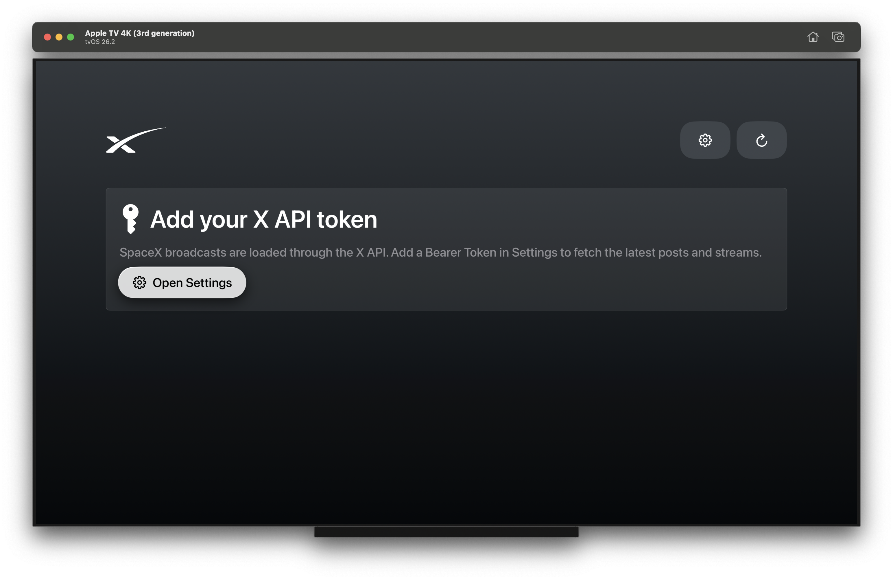
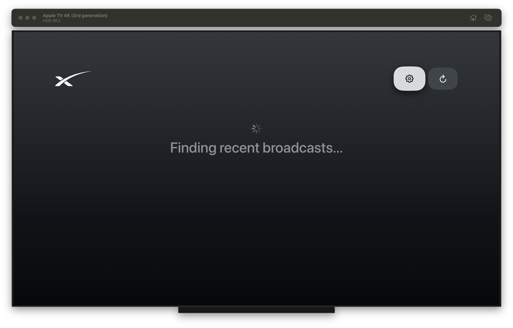
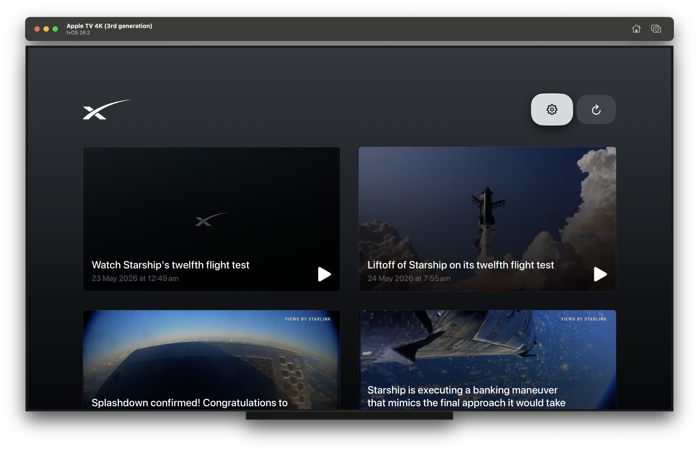
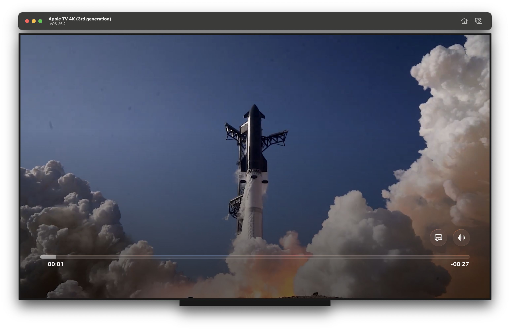

# SpaceX TV

Native tvOS SwiftUI app for watching SpaceX broadcasts from X on Apple TV.

The app discovers recent SpaceX broadcast posts, shows them as selectable poster cards, resolves playable X/Periscope streams, and plays them with `AVPlayerViewController`.





## Features

- X API timeline discovery with a user-supplied [Bearer Token](https://docs.x.com/x-api/introduction).
- Home-screen prompt when no X API Bearer Token is configured.
- SpaceX pinned post discovery, including pinned posts that link to `x.com/i/broadcasts/...`.
- Playback for live and ended broadcasts by resolving X web playback metadata at play time.
- Highest-quality stream selection from available HLS or MP4 variants.
- First page of 10 broadcasts on launch, then another 10 when scrolling to the end.
- Daily cache for API discovery responses so app relaunches do not always hit X again.
- Full-width tvOS player with end-of-video actions for Back and Replay.
- Settings view opened from the gear button.
- Secure Bearer Token field stored in Keychain.
- Optional player debug overlay, off by default.
- Broadcast cards with thumbnail backgrounds, tweet text, and date.

## Broadcast Discovery

Discovery prefers X API v2:

1. `GET /2/users/by/username/spacex` with `user.fields=pinned_tweet_id`
2. `GET /2/tweets` for the pinned post, when one exists
3. `GET /2/users/{id}/tweets` for recent SpaceX posts

The app requires a user-supplied X API Bearer Token. Without one, the home screen shows a prompt to add the token in Settings.

The app reads attached media variants and linked broadcast URLs from the returned posts. Pinned and timeline results are de-duplicated by broadcast ID where possible, then by stream URL, normalized post text, or status URL. No profile-scraping or static HLS fallback URLs are bundled.

## Settings

Open Settings with the gear icon in the root view.

- `Bearer Token`: [X API Bearer Token](https://docs.x.com/x-api/introduction) for timeline discovery.
- `Player Debug Overlay`: shows AVPlayer status, access log, and error log details while playing.

For simulator testing, the easiest token entry path is usually paste through the simulator keyboard. The token is saved to Keychain and is not hard-coded in the app.

## Build

Open `SpaceXTV.xcodeproj` in Xcode and run the `SpaceXTV` target on an Apple TV simulator or device.

Command-line build:

```sh
xcodebuild -project SpaceXTV.xcodeproj -target SpaceXTV -sdk appletvsimulator build
```
