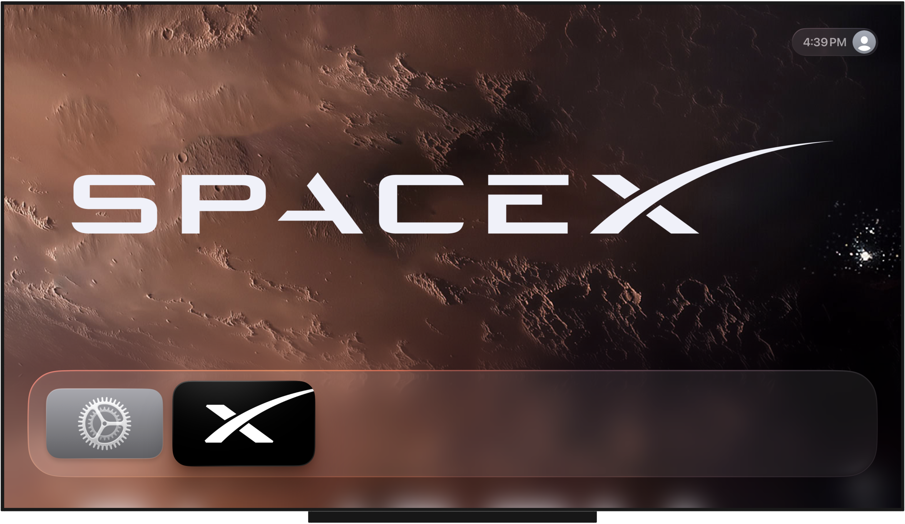
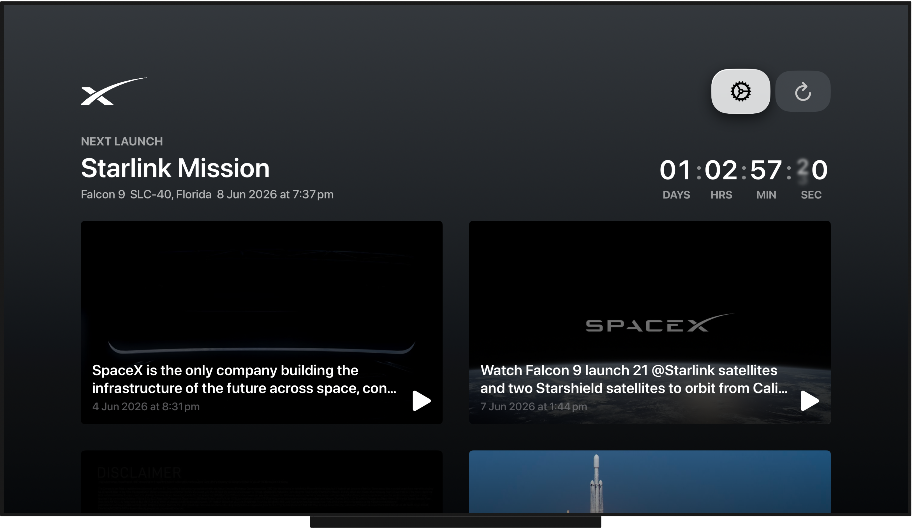
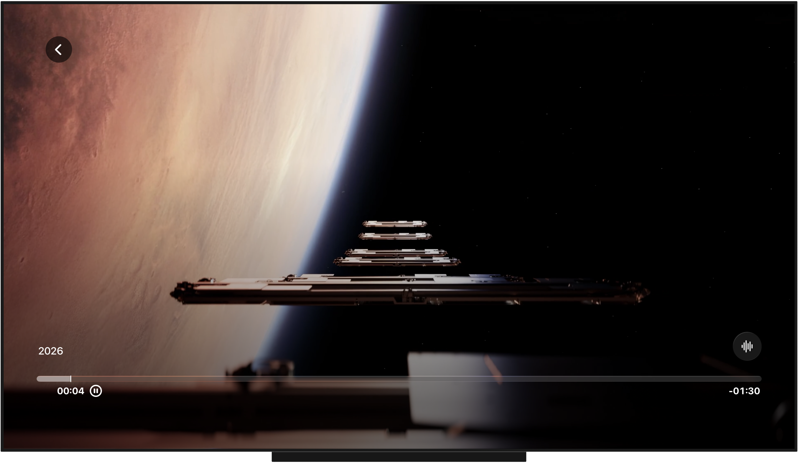
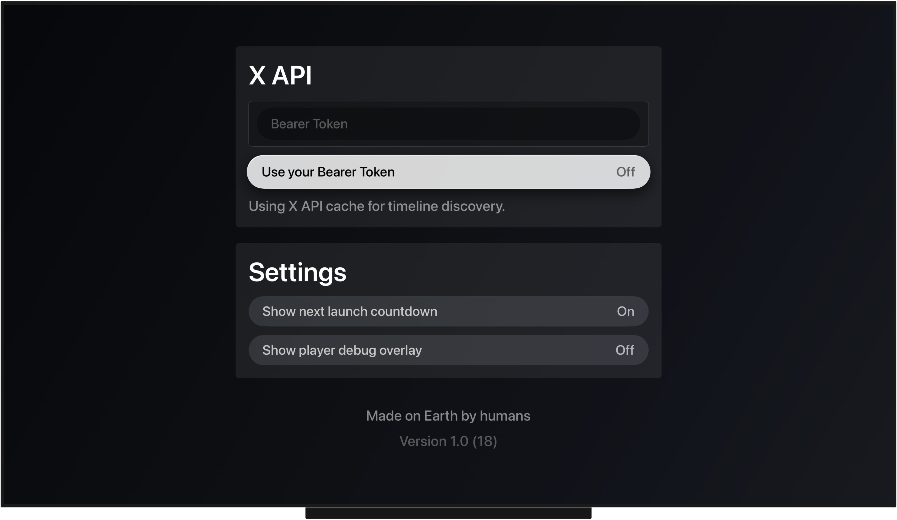
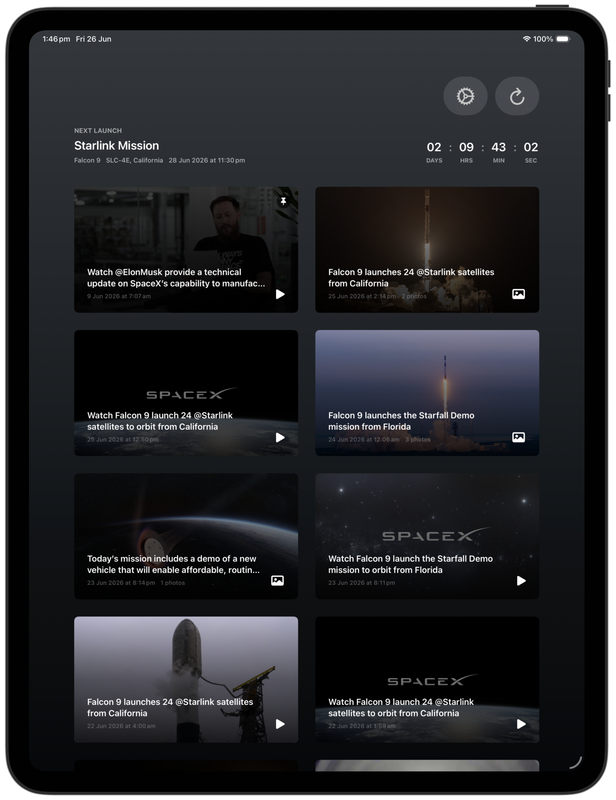
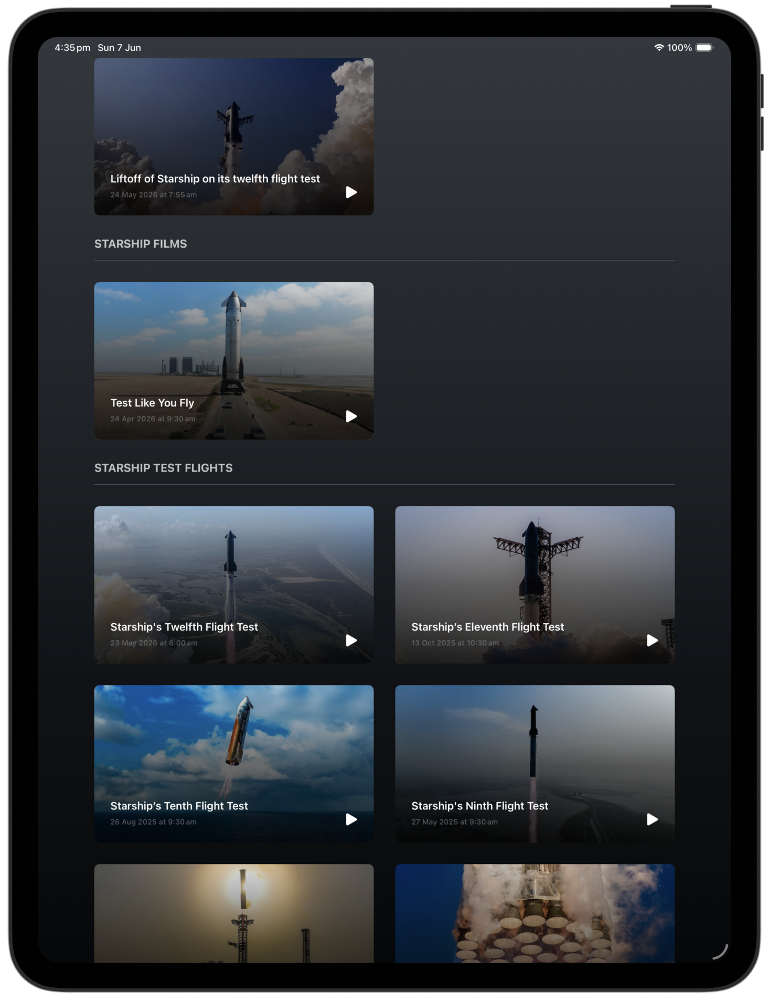
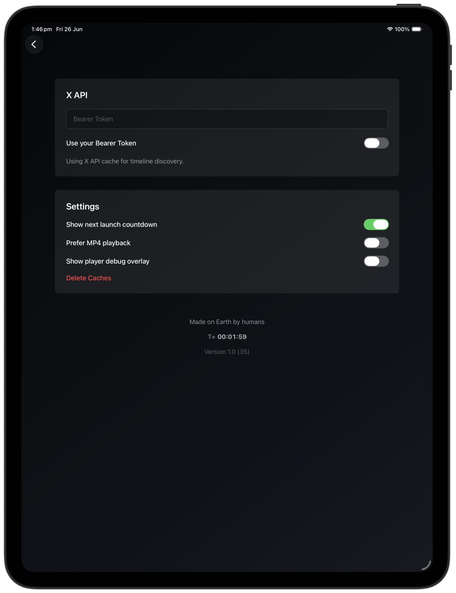

# SpaceX TV

Native tvOS SwiftUI app for watching SpaceX broadcasts from X on Apple TV.

The app discovers recent SpaceX broadcast posts, shows them as selectable poster cards, resolves playable X/Periscope streams, and plays them with `AVPlayerViewController`.

  
 

  

## Features

- X API timeline discovery from a hosted daily cache by default, with an opt-in user-supplied [Bearer Token](https://docs.x.com/x-api/introduction) mode.
- SpaceX Starship film discovery from the public `STARSHIP` media playlist on spacex.com.
- Next-launch countdown loaded from the same SpaceX launches feeds used by [spacex.com/launches](https://www.spacex.com/launches).
- Hosted X API cache fallback for users who have not configured their own Bearer Token.
- SpaceX pinned post discovery, including pinned posts that link to `x.com/i/broadcasts/...`.
- Playback for live and ended broadcasts by resolving X web playback metadata at play time.
- Highest-quality stream selection from available HLS or MP4 variants.
- First load uses 25 recent SpaceX posts and reposts, showing every playable result, with deeper post fetches when scrolling to the end.
- Daily cache for API discovery responses so app relaunches do not always hit X again.
- Full-width tvOS player with end-of-video actions for Back and Replay.
- Settings view opened from the gear button.
- Secure Bearer Token field stored in Keychain.
- Optional player debug overlay, off by default.
- Broadcast cards with thumbnail backgrounds, tweet text, and date.

## Broadcast Discovery

Discovery can use X API v2 with the user's own Bearer Token:

1. `GET /2/users/by/username/spacex` with `user.fields=pinned_tweet_id`
2. `GET /2/tweets` for the pinned post, when one exists
3. `GET /2/users/{id}/tweets` for recent SpaceX posts

By default, the app uses `https://www.sighmon.com/spacex-tv/x-cache.json`. The fallback JSON is generated by `scripts/update_spacex_x_cache.rb` and contains the same X API response shapes used by the app's token-backed discovery path, plus snapshots of the Starship film playlists, launch tiles, and Starship mission records. In Settings, `Use Bearer Token data` switches discovery to the user's own X API token when one is present.

The app reads attached media variants and linked broadcast URLs from every post returned by the current X API timeline request, including quoted posts and reposts when SpaceX's post has no media of its own, then shows every playable result. It also reads SpaceX's `STARSHIP` media playlist so new Starship films appear automatically. Pinned, timeline, and Starship media results are de-duplicated by broadcast ID where possible, then by stream URL, normalized post text, status URL, or SpaceX media ID. Pinned posts stay at the top, timeline results follow by date, and Starship films are appended after the X posts. No profile-scraping or static HLS fallback URLs are bundled.

## Settings

Open Settings with the gear icon in the root view.

- `Bearer Token`: [X API Bearer Token](https://docs.x.com/x-api/introduction) for timeline discovery.
- `Use Bearer Token data`: off by default. When enabled, discovery uses the saved Bearer Token when present; otherwise it uses the hosted cache.
- `Player Debug Overlay`: shows AVPlayer status, access log, and error log details while playing.

For simulator testing, the easiest token entry path is usually paste through the simulator keyboard. The token is saved to Keychain and is not hard-coded in the app.

## Hosted X API Cache

The fallback cache is intended for shared hosting where Ruby and cron are available without extra packages. The script reads the X API Bearer Token from `X_BEARER_TOKEN`, fetches the latest 25 SpaceX posts and reposts, calculates their broadcast/gallery card results, snapshots SpaceX's Starship films, flight tests, launch tiles, and mission data, and writes JSON to `~/www.sighmon.com/spacex-tv/x-cache.json`. Unchanged processed cards are reused until their normal expiry. The app imports these processed results and the SpaceX CMS snapshot in hosted-cache mode; `Use Bearer Token data` continues to fetch and calculate data on-device.

Install the scripts somewhere outside the web root, for example:

```sh
mkdir -p ~/scripts
cp scripts/update_spacex_x_cache.rb scripts/spacex_x_card_processor.rb ~/scripts/
cp scripts/run_spacex_cache_update.sh ~/scripts/run_spacex_cache_update.sh
cp scripts/check_spacex_launch_cache.rb ~/scripts/check_spacex_launch_cache.rb
cp scripts/run_spacex_launch_cache_check.sh ~/scripts/run_spacex_launch_cache_check.sh
chmod 700 ~/scripts/update_spacex_x_cache.rb ~/scripts/run_spacex_cache_update.sh ~/scripts/check_spacex_launch_cache.rb ~/scripts/run_spacex_launch_cache_check.sh
```

Edit `~/scripts/run_spacex_cache_update.sh` and `~/scripts/run_spacex_launch_cache_check.sh` on the server and replace `YOUR_X_API_BEARER_TOKEN` and `YOUR_WEBHOST_USER`.

Full crontab example for once a day at 6:00am Adelaide time:

```cron
CRON_TZ=Australia/Adelaide
0 6 * * * /home/YOUR_WEBHOST_USER/scripts/run_spacex_cache_update.sh >> /home/YOUR_WEBHOST_USER/spacex-tv-x-cache.log 2>&1
```

If your WebHost cron editor does not honor `CRON_TZ`, set the panel schedule to the equivalent server-local time and keep the command itself unchanged.

The script logs timestamped start, success, and failure lines. To test the hosted copy over SSH:

```sh
/home/YOUR_WEBHOST_USER/scripts/run_spacex_cache_update.sh >> /home/YOUR_WEBHOST_USER/spacex-tv-x-cache.log 2>&1
tail -n 40 /home/YOUR_WEBHOST_USER/spacex-tv-x-cache.log
ls -l /home/YOUR_WEBHOST_USER/www.sighmon.com/spacex-tv/x-cache.json
```

WebHost cron commands that use `setlock` should redirect after the `setlock` command, so lock failures or missing-command errors are captured too:

```cron
@daily /usr/bin/setlock -n /tmp/cronlock.YOUR_LOCK_ID /home/YOUR_WEBHOST_USER/scripts/run_spacex_cache_update.sh >> /home/YOUR_WEBHOST_USER/spacex-tv-x-cache.log 2>&1
```

To refresh the cache near launch time, add a second cron job that runs every five minutes. It checks the same SpaceX launch timing feeds used by the app countdown and runs the X cache updater whenever the next launch is within 10 minutes. Re-fetching on each cron tick also handles multiple launches close together and cards published after the first check. Use the same lock path as the daily updater so the two jobs cannot write the cache at the same time:

```cron
*/5 * * * * /usr/bin/setlock -n /tmp/cronlock.YOUR_LOCK_ID /home/YOUR_WEBHOST_USER/scripts/run_spacex_launch_cache_check.sh >> /home/YOUR_WEBHOST_USER/spacex-tv-x-cache.log 2>&1
```

## Build

Open `SpaceXTV.xcodeproj` in Xcode and run the `SpaceXTV` target on an Apple TV simulator or device.

Command-line build:

```sh
xcodebuild -project SpaceXTV.xcodeproj -target SpaceXTV -sdk appletvsimulator build
```

## Privacy policy

This app collects no personal data.
